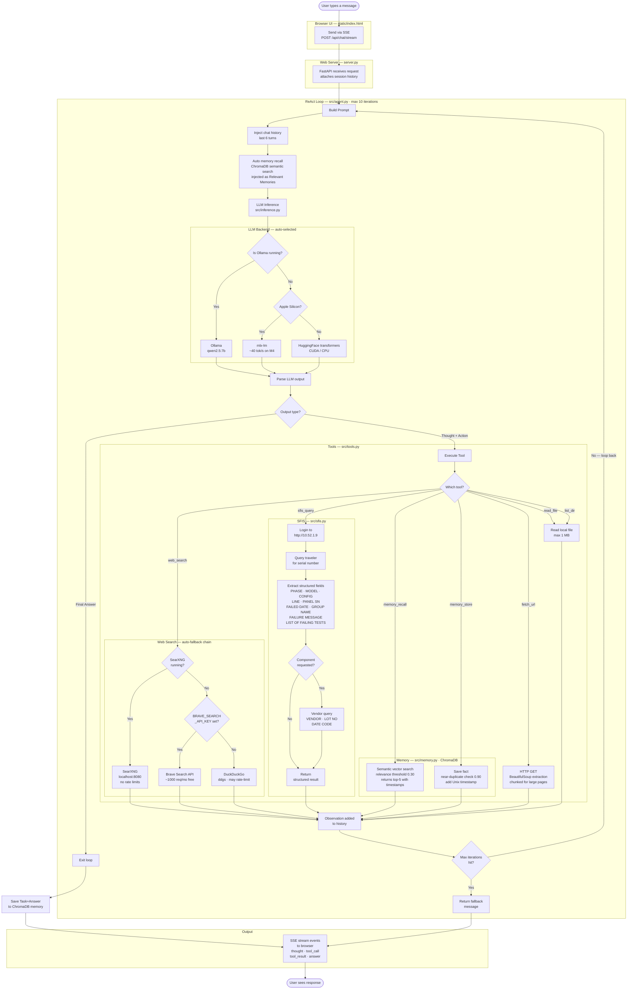

# Local LLM Agent

Local ReAct agent running the Qwen3-9B model (safetensors format). Capabilities: web search, persistent vector memory, SFIS manufacturing database query, file tools, and web scraping.

**Primary runtime:** Mac Mini M4 24GB — uses mlx-lm for fast native inference (~40 tok/s).
**Secondary:** Asus Laptop with NVIDIA GPU — falls back to HuggingFace transformers (CUDA).

---

## Architecture

- `src/agent.py` — LangGraph ReAct loop (think → act → respond)
- `src/inference.py` — LLM backend: Ollama → mlx-lm → transformers (auto-fallback)
- `src/tools.py` — 7 LangChain tools (web_search, fetch_url, read_file, list_dir, memory_store, memory_recall, sfis_query)
- `src/memory.py` — ChromaDB vector store for persistent memory
- `src/sfis.py` — Headless SFIS client (http://10.52.1.9)
- `server.py` — FastAPI + SSE streaming web server (port 8088)
- `static/index.html` — Dark-theme chat UI

---

## Full Agent Flow



### Event stream from agent to UI

Each step in the loop emits an SSE event the browser renders in real time:

| Event | When emitted | UI display |
|-------|-------------|------------|
| `start` | Loop begins | — |
| `thought` | LLM produces a Thought | Italicised thought block |
| `tool_call` | Tool about to run | Collapsible tool card with icon |
| `tool_result` | Tool returned | Result inside the card |
| `answer` | Final Answer produced | Markdown-rendered answer |
| `error` | Exception thrown | Error message |
| `done` | Loop finished | — |

---

## Changes Made (2026-05-16)

### src/sfis.py — Structured field extraction
**Problem:** Original code dumped all SFIS tables as raw key-value pairs — verbose, noisy, and hard for the LLM to reason about.

**Fix:** Rewrote `_query_traveler` to extract exactly the fields engineers care about, matching the logic from `test/get_fa_data_on_sfis 6.py`:
- `PHASE`, `MODEL`, `CONFIG` from "Work Order / Model Data"
- `LINE`, `PANEL SN` from "SN Detail Data"
- `SN SEQ IN PANEL` from "Wip Tracking Data"
- `FAILED DATE`, `GROUP NAME`, `LIST OF FAILING TESTS` from "SN Repair Data" (filtered to failure stations: burn_in, fct, cell, wifi, etc.)
- `LAB IN TIME` from "Laboratory In/Out"
- `FAILURE MESSAGE` + refined test list from "Bobcat Data" (matched by FAAP station + stop time)

Output is now a clean, ordered list of fields instead of a raw table dump.

### src/tools.py — Robust web search
**Problem:** `from ddgs import DDGS` was hard-coded — crashes if the older `duckduckgo_search` package is installed instead. No retry on rate-limit errors.

**Fix:**
- Import tries `duckduckgo_search` first, then `ddgs`, then returns a clear install message if neither is found
- Added 3-attempt retry with exponential backoff (1s → 2s → 4s) to handle DuckDuckGo rate limiting

### src/memory.py — Better retrieval quality
**Problem:** Memory search returned all results regardless of relevance score, accumulated duplicates, no way to know when memories were stored.

**Fix:**
- **Relevance threshold (0.30):** results below this cosine-similarity score are filtered out — stops irrelevant memories polluting the context
- **Near-duplicate detection (0.90):** before saving, checks if a very similar memory already exists — prevents the store from growing with repeated facts
- **Timestamps:** every memory is stored with a Unix timestamp; `search_text` shows "5m ago / 2h ago / 3d ago" next to each result
- **`recent(k)` method:** returns the k most recently added memories sorted by time

### src/agent.py — Smarter prompting
- Updated system prompt (removed "Mac Mini M4" reference, added guidance on memory use and concise storage)
- **Auto memory recall:** on the first step of every task, relevant memories are automatically searched and injected into the prompt as "Relevant Memories" — the agent sees prior findings without having to call `memory_recall` manually
- Added `sfis_query: "🏭"` to tool icons for the web UI

### requirements.txt
- Replaced `duckduckgo-search>=6.0.0` → `ddgs>=7.0.0` (current package name)
- Replaced `llama-cpp-python` (unused, Apple Metal comment was misleading) → `mlx-lm>=0.19.0`
- Added notes explaining the two-backend setup

---

## Web Search Engine Options

Current tool uses DuckDuckGo (ddgs), which can be rate-limited and blocked. Fully local alternatives to consider:

| Option | Type | Pros | Cons | Best For |
|--------|------|------|------|----------|
| **SearXNG** | Self-hosted metasearch | Best quality, JSON API, aggregates multiple engines | Needs Docker/server running locally | Drop-in DuckDuckGo replacement |
| **Crawl4AI** | Local scraper | Full page content, JS support | Slower, no keyword search | Enhancing `fetch_url` |
| **Playwright** | Browser automation | Most powerful, handles any site | Heavy, needs more code | Advanced scraping |
| **Jina Reader** | URL-to-markdown | Very clean text output | Needs URL first, no search | Replacing `fetch_url` |

**Recommendation:** Replace DuckDuckGo with **SearXNG** for web search, and optionally replace `fetch_url` with **Crawl4AI** or **Jina Reader** for cleaner page content. See notes below.

---

## Web Search Backends

The agent auto-detects the best available search backend. Priority order:

```
SearXNG (local) → Brave Search API → DuckDuckGo
```

Each result block is labelled with the source used (e.g. `[Search via Brave Search]`).

---

### Option 1 — Brave Search API (Recommended for Mac, no Docker needed)

Free tier: ~1000 requests/month (enough for daily dev use).

**Setup (5 minutes):**
1. Register at https://api-dashboard.search.brave.com
2. Create an API key under "API Keys"
3. Add to your environment:
```bash
export BRAVE_SEARCH_API_KEY=your_key_here
```
Or add to a `.env` file in the project root (loaded automatically via python-dotenv):
```
BRAVE_SEARCH_API_KEY=your_key_here
```

No installation beyond the existing `requests` package needed.

---

### Option 2 — SearXNG (Fully Local, No API Key)

Best long-term option — no quotas, no external dependencies, aggregates Google + Bing + DDG + Brave.

#### Step 1 — Copy files to USB (done on Windows machine with internet)

Two files are already saved on the USB drive (E:):

| File | Size | Purpose |
|------|------|---------|
| `OrbStack-arm64.dmg` | 404 MB | Container runtime for Apple Silicon Mac |
| `searxng-image.tar` | 92 MB | SearXNG Docker image (offline, no internet needed) |

To re-download if needed (run on Windows with Docker Desktop open):
```powershell
# OrbStack installer
Invoke-WebRequest -Uri "https://orbstack.dev/download/stable/latest/arm64" -OutFile "E:\OrbStack-arm64.dmg"

# SearXNG image
docker pull ghcr.io/searxng/searxng:latest
docker save ghcr.io/searxng/searxng:latest -o "E:\searxng-image.tar"
```

#### Step 2 — Install OrbStack on Mac (from USB, no internet needed)

1. Plug in USB — note the volume name shown in Finder under Locations (e.g. `MY_USB`)
2. Double-click `OrbStack-arm64.dmg` on the USB
3. Drag OrbStack to Applications
4. Launch OrbStack once — it installs its components and starts automatically

#### Step 3 — Load SearXNG image and start

```bash
# Load image from USB (no internet needed)
docker load -i /Volumes/YOUR_USB_NAME/searxng-image.tar

# Start SearXNG
cd /path/to/local-LLM-agent
docker compose up -d        # starts at http://localhost:8080
docker compose down         # stop when not needed
```

Replace `YOUR_USB_NAME` with the actual USB volume name shown in Finder.

#### Step 4 — Verify

```bash
curl "http://localhost:8080/search?q=test&format=json"
```

Should return JSON. If you see `403 Forbidden`, wait 10 seconds and retry — container may still be starting.

**OrbStack starts automatically on Mac login** — after initial setup, just run `docker compose up -d` each session.

Config files: `docker-compose.yml`, `searxng/settings.yml` (JSON API + rate limiting disabled already configured).

---

### Option 3 — DuckDuckGo (Built-in Fallback)

Requires `pip install ddgs`. Works out of the box but can be rate-limited under heavy use.

---

## Known Issues / TODO

- Memory embedding uses ChromaDB's default model (all-MiniLM-L6-v2), downloaded on first run
- Session history is in-memory only — lost on server restart
- No token budget management — very long prompts may overflow Qwen context window
